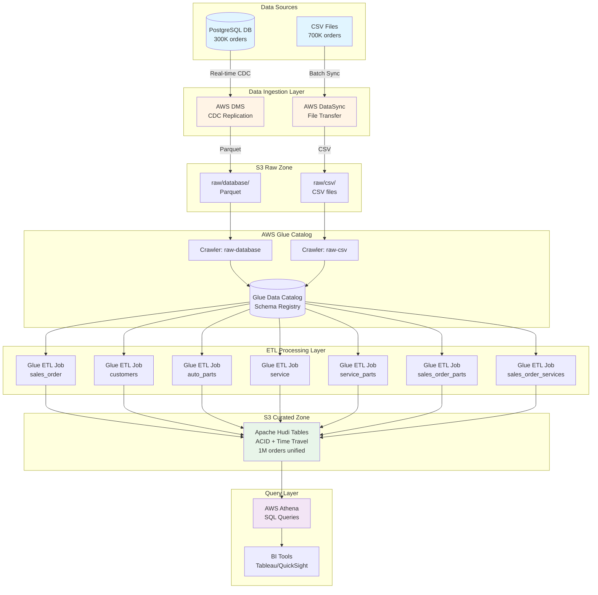
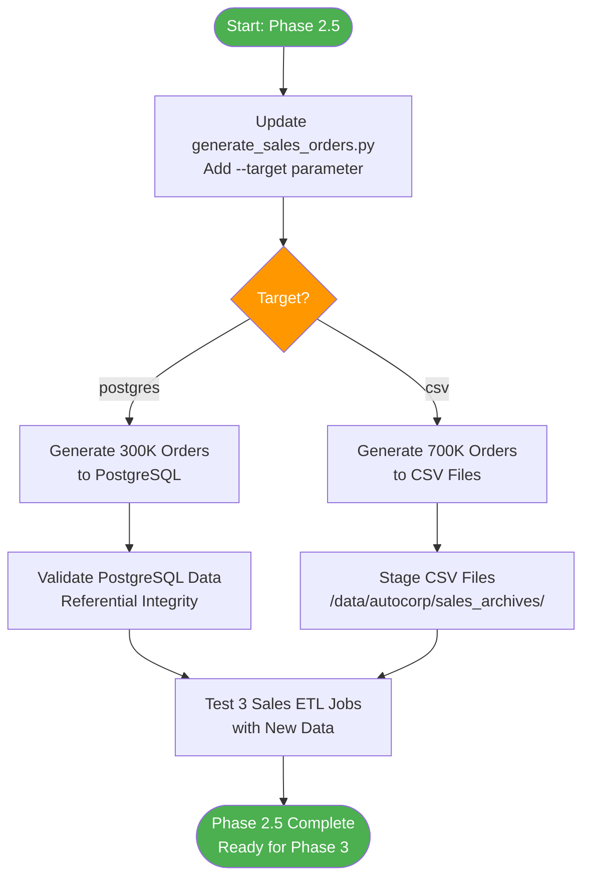
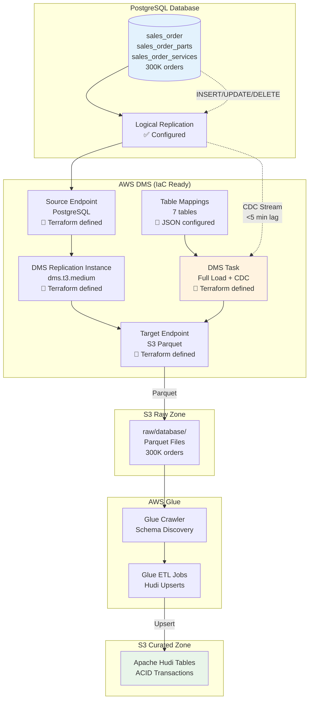
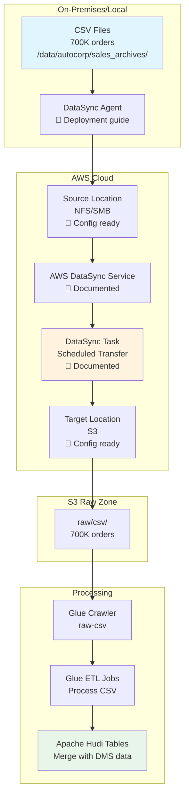
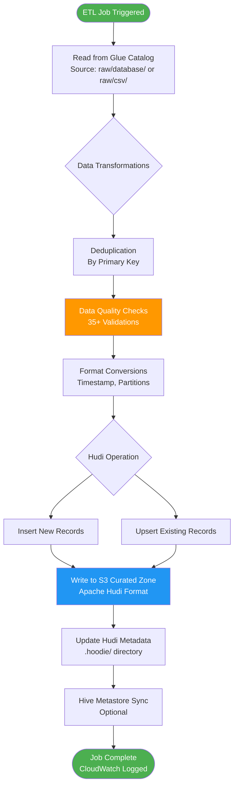
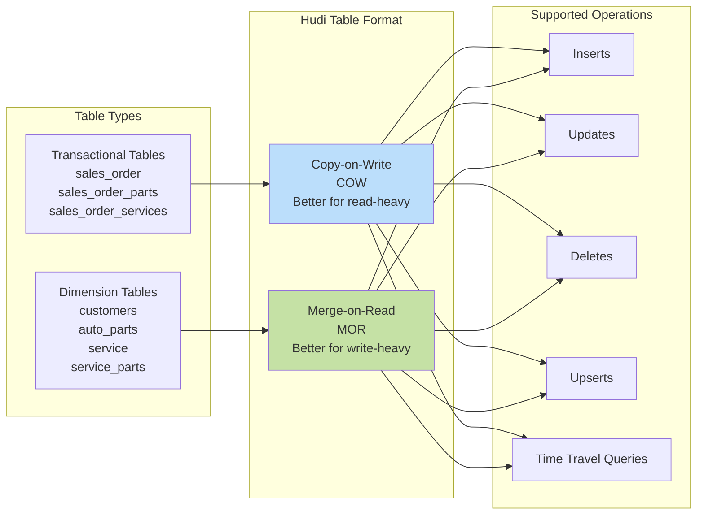
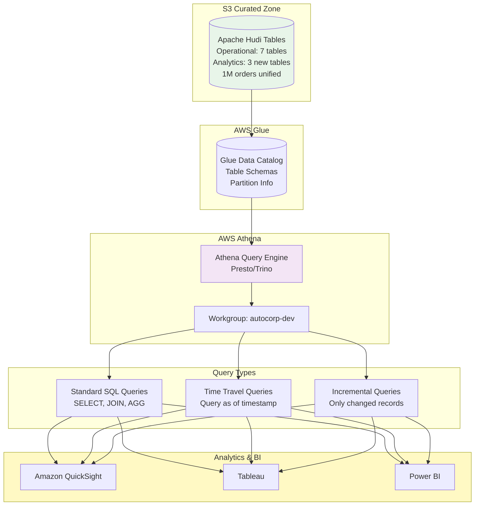
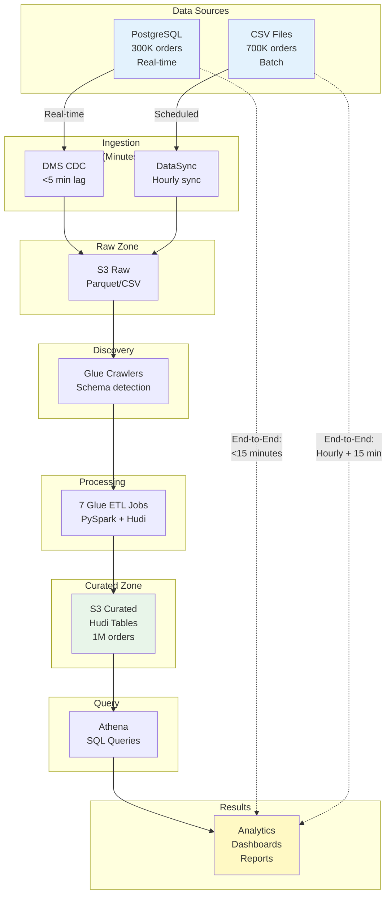
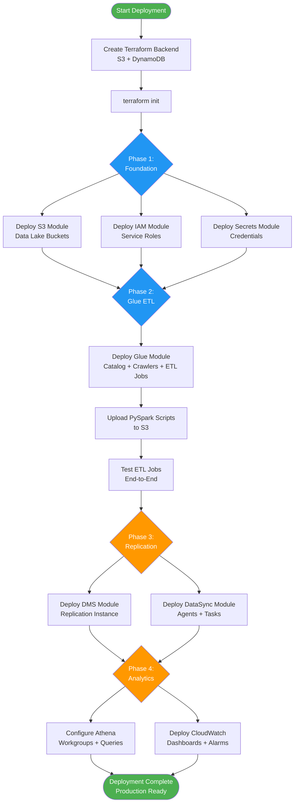

# AutoCorp Data Lake Pipeline - Process Flow Diagram

**Project:** AutoCorp Cloud Data Lakehouse  
**Created:** December 7, 2025  
**Last Updated:** December 16, 2025  
**Version:** 1.1

---

## 1. High-Level Data Flow Architecture

---

## 2. Project Phase Flow

```mermaid
flowchart LR
    subgraph Phase1["Phase 1: Foundation<br/>(Nov 18-22)"]
        P1A[Database Setup]
        P1B[IaC Development]
        P1C[Terraform Deploy]
    end
    
    subgraph Phase2["Phase 2: Glue ETL<br/>(Nov 25 - Dec 7)"]
        P2A[Create ETL Scripts]
        P2B[Deploy Glue Jobs]
        P2C[Data Quality Rules]
        P2D[End-to-End Testing]
    end
    
    subgraph Phase25["Phase 2.5: Data Prep<br/>(Dec 7-8)"]
        P25A[Generate PostgreSQL<br/>300K orders]
        P25B[Generate CSV<br/>700K orders]
        P25C[Validate Data]
    end
    
    subgraph Phase3["Phase 3: DMS IaC<br/>(Dec 7-16)"]
        P3A[Configure PostgreSQL<br/>Logical Replication]
        P3B[DMS Terraform Module<br/>361 lines]
        P3C[DataSync Documentation<br/>Production Guide]
        P3D[Phase 3 IaC Complete]
    end
    
    subgraph Phase4["Phase 4: Analytics<br/>(Dec 16-20)"]
        P4A[Analytics ETL Jobs<br/>3 scripts created]
        P4B[Configure Athena<br/>Workgroups]
        P4C[Query Optimization<br/>Partitioning]
        P4D[Documentation<br/>Finalization]
    end
    
    P1A --> P1B --> P1C
    P1C --> P2A
    P2A --> P2B --> P2C --> P2D
    P2D --> P25A
    P25A --> P25B --> P25C
    P25C --> P3A
    P3A --> P3B --> P3C --> P3D
    P3D --> P4A
    P4A --> P4B --> P4C --> P4D
    
    style Phase1 fill:#c8e6c9
    style Phase2 fill:#c8e6c9
    style Phase25 fill:#c8e6c9
    style Phase3 fill:#c8e6c9
    style Phase4 fill:#fff9c4
```

---

## 3. Data Generation & Loading Flow (Phase 2.5)

---

## 4. DMS CDC Replication Flow (Phase 3 - IaC Ready)

**Status:** Infrastructure as Code complete, ready for deployment

---

## 5. DataSync File Transfer Flow (Phase 3 - Documented)

**Status:** Production deployment guide documented, S3 CLI alternative for dev

---

## 6. ETL Job Processing Flow

---

## 7. Hudi Table Strategy Flow

---

## 8. Query Layer Flow (Phase 4 - In Progress)

**Status:** Analytics ETL scripts created, Athena configuration in progress

---

## 9. Complete End-to-End Flow with Timing

---

## 10. Infrastructure Deployment Flow

---

## Diagram Descriptions

### 1. High-Level Data Flow Architecture
Shows the complete data flow from source systems through ingestion, transformation, and query layers.

### 2. Project Phase Flow
Illustrates the sequential progression through all project phases with dependencies.

### 3. Data Generation & Loading Flow (Phase 2.5)
Details the current data preparation step including PostgreSQL and CSV generation.

### 4. DMS CDC Replication Flow (Phase 3)
Shows how PostgreSQL data is replicated to S3 via DMS with CDC.

### 5. DataSync File Transfer Flow (Phase 3)
Illustrates the batch file transfer process from on-premises to S3.

### 6. ETL Job Processing Flow
Details the internal logic of Glue ETL jobs including transformations and Hudi operations.

### 7. Hudi Table Strategy Flow
Explains the decision logic for COW vs MOR table formats.

### 8. Query Layer Flow (Phase 4)
Shows how Athena queries Hudi tables and integrates with BI tools.

### 9. Complete End-to-End Flow with Timing
Provides timing expectations for each stage of the pipeline.

### 10. Infrastructure Deployment Flow
Maps out the Terraform deployment sequence across all phases.

---

## Legend

- **Green boxes**: Start/End points, completed phases
- **Blue boxes**: Infrastructure components
- **Orange boxes**: Decision points, in-progress phases
- **Light blue**: Data storage layers
- **Light green**: Hudi/curated zone
- **Light yellow**: Analytics/BI layer
- **Dotted lines**: Data flow paths or timing indicators
- **Solid lines**: Process flow or dependencies

---

## Usage Notes

These diagrams are written in Mermaid format and can be rendered in:
- GitHub markdown files
- VS Code with Mermaid extension
- Mermaid Live Editor (https://mermaid.live/)
- Documentation tools like Confluence with Mermaid support
- Draw.io (import Mermaid)

To view these diagrams, paste the code blocks into any Mermaid-compatible viewer.

---

---

## Document Change Log

### Version 1.1 (December 16, 2025)
- Updated Phase 3 to reflect IaC completion (DMS Terraform module, PostgreSQL CDC config, DataSync docs)
- Updated Phase 4 to show analytics layer in progress (3 ETL scripts created)
- Changed phase color coding to reflect completion status
- Added status notes to DMS, DataSync, and Query Layer sections
- Updated dates to reflect actual project timeline

### Version 1.0 (December 7, 2025)
- Initial process flow diagram creation
- 10 comprehensive flow diagrams
- Complete end-to-end architecture documentation

---

**Document Version:** 1.1  
**Last Updated:** December 16, 2025  
**Created:** December 7, 2025  
**Author:** scotton  
**Project:** AutoCorp Data Lake Pipeline  
**Status:** Phase 3 Complete (IaC) | Phase 4 Analytics Layer In Progress
