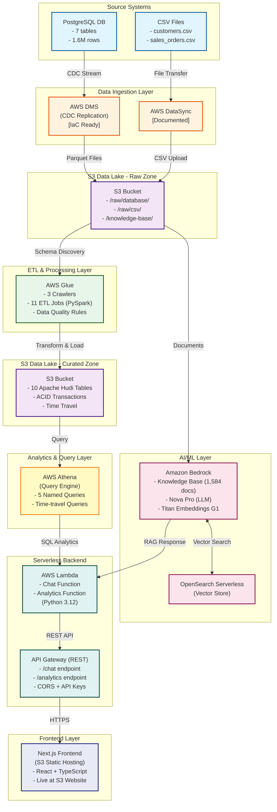

```mermaid
graph TB
    subgraph Sources["Source Systems"]
        PG["PostgreSQL DB<br/>- 7 tables<br/>- 1.6M rows"]
        CSV["CSV Files<br/>- customers.csv<br/>- sales_orders.csv"]
    end
    
    subgraph Ingestion["Data Ingestion Layer"]
        DMS["AWS DMS<br/>(CDC Replication)<br/>[IaC Ready]"]
        DS["AWS DataSync<br/>[Documented]"]
    end
    
    subgraph RawZone["S3 Data Lake - Raw Zone"]
        S3Raw["S3 Bucket<br/>- /raw/database/<br/>- /raw/csv/<br/>- /knowledge-base/"]
    end
    
    subgraph Transform["ETL & Processing Layer"]
        Glue["AWS Glue<br/>- 3 Crawlers<br/>- 11 ETL Jobs (PySpark)<br/>- Data Quality Rules"]
    end
    
    subgraph CuratedZone["S3 Data Lake - Curated Zone"]
        S3Curated["S3 Bucket<br/>- 10 Apache Hudi Tables<br/>- ACID Transactions<br/>- Time Travel"]
    end
    
    subgraph Analytics["Analytics & Query Layer"]
        Athena["AWS Athena<br/>(Query Engine)<br/>- 5 Named Queries<br/>- Time-travel Queries"]
    end
    
    subgraph AI["AI/ML Layer"]
        Bedrock["Amazon Bedrock<br/>- Knowledge Base (1,584 docs)<br/>- Nova Pro (LLM)<br/>- Titan Embeddings G1"]
        AOSS["OpenSearch Serverless<br/>(Vector Store)"]
    end
    
    subgraph Backend["Serverless Backend"]
        Lambda["AWS Lambda<br/>- Chat Function<br/>- Analytics Function<br/>(Python 3.12)"]
        APIGW["API Gateway (REST)<br/>- /chat endpoint<br/>- /analytics endpoint<br/>- CORS + API Keys"]
    end
    
    subgraph Frontend["Frontend Layer"]
        NextJS["Next.js Frontend<br/>(S3 Static Hosting)<br/>- React + TypeScript<br/>- Live at S3 Website"]
    end
    
    %% Data Flow
    PG -->|CDC Stream| DMS
    CSV -->|File Transfer| DS
    DMS -->|Parquet Files| S3Raw
    DS -->|CSV Upload| S3Raw
    S3Raw -->|Schema Discovery| Glue
    Glue -->|Transform & Load| S3Curated
    S3Curated -->|Query| Athena
    S3Raw -->|Documents| Bedrock
    Bedrock <-->|Vector Search| AOSS
    Athena -->|SQL Analytics| Lambda
    Bedrock -->|RAG Response| Lambda
    Lambda -->|REST API| APIGW
    APIGW -->|HTTPS| NextJS
    
    %% Styling
    classDef sourceStyle fill:#e1f5ff,stroke:#01579b,stroke-width:2px
    classDef ingestionStyle fill:#fff3e0,stroke:#e65100,stroke-width:2px
    classDef storageStyle fill:#f3e5f5,stroke:#4a148c,stroke-width:2px
    classDef transformStyle fill:#e8f5e9,stroke:#1b5e20,stroke-width:2px
    classDef analyticsStyle fill:#fff9c4,stroke:#f57f17,stroke-width:2px
    classDef aiStyle fill:#fce4ec,stroke:#880e4f,stroke-width:2px
    classDef backendStyle fill:#e0f2f1,stroke:#004d40,stroke-width:2px
    classDef frontendStyle fill:#e8eaf6,stroke:#1a237e,stroke-width:2px
    
    class PG,CSV sourceStyle
    class DMS,DS ingestionStyle
    class S3Raw,S3Curated storageStyle
    class Glue transformStyle
    class Athena analyticsStyle
    class Bedrock,AOSS aiStyle
    class Lambda,APIGW backendStyle
    class NextJS frontendStyle
```